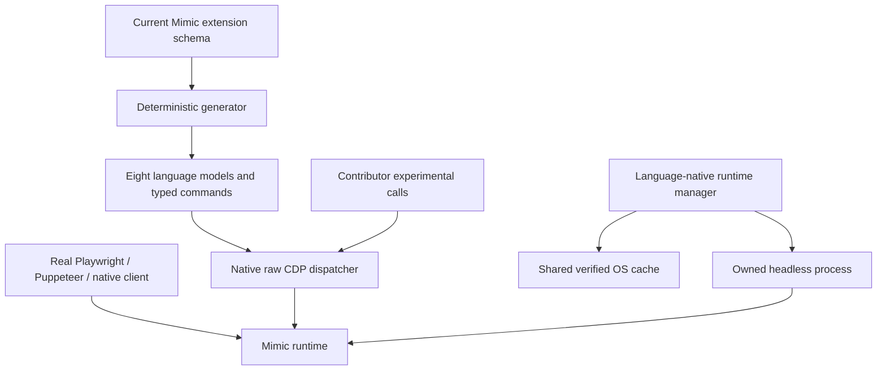

# SDK architecture

There are three ownership boundaries. The runtime manager owns only artifact
resolution, immutable cache state and a launched process. The integration owns
the selected framework connection, its helper-created contexts and the explicit
extension connection. The framework owns its genuine Browser/Context/Page/
Locator objects and their ordinary automation semantics.

Typed methods and experimental calls converge on the same extension dispatcher.
They share request IDs, pending call routing, event ordering, error envelopes,
timeouts and closure. Page clients bind to CDP sessions created on that same
connection: a session ID from another framework socket is not reusable.

Framework methods that discard CDP error code/data are not used as the raw
extension transport. The additional connection is created explicitly when the
integration starts, rather than lazily for each experimental command. Rod can
use the native SDK dispatcher directly through its public client interface.

Context helpers return native contexts. Where the framework does not expose a
public CDP context ID, a helper briefly creates an owned blank page, queries its
target, closes it, and configures the still-empty context. The runtime's
`Mimic.configureContext` validates the whole profile/media/proxy/policy request
before changing identity. Active, initializing or closing pages and retained
upload/capture work prevent that transition. Managed profiles stay immutable;
repeating an already selected media/font value is an idempotent operation.

Ordinary framework contexts retain normal CDP overrides. Managed contexts use
the framework's public no-override viewport/media options so their environment
profile remains authoritative. Conflicting user overrides fail explicitly.

Installation state is shared, execution state is not. An installation lock
covers verification, atomic publication, launch verification and durable lease
creation. Pruning takes the same lock and rejects live or unverifiable leases.
Neither installation locks nor a global browser lock serialize independent
runtime processes or Pages.

The canonical schema describes shapes, not semantic support. The runtime's
`internal/cdp/protocol_support.json` records supported behavior and limitations.
Each repository retains one current contract, not legacy API modes. Source and
schema hashes are provenance, while exact runtime versions select artifacts.

SDK package versions and runtime releases are independent. The package manifest
and explicit release plans select native distributions; qualification receipts
can change without republishing SDKs. A changed default runtime pin requires an
intentional SDK source change and a newly qualified package release.
